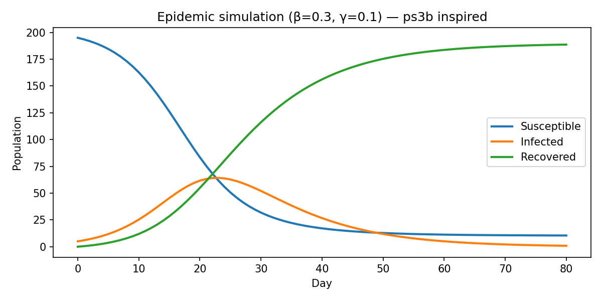
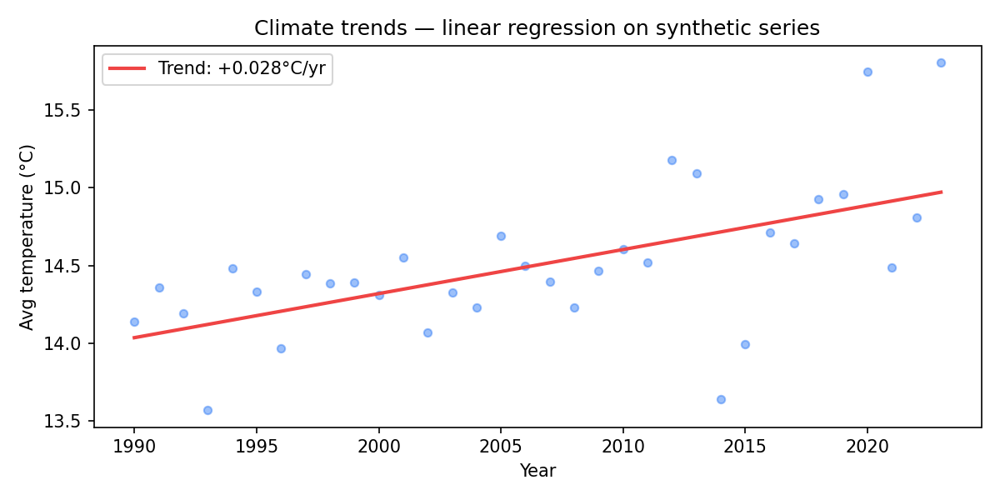

# mitx-6002-simulation-lab

**MITx 6.00.2x — Introduction to Computational Thinking and Data Science**

Pensamento computacional aplicado: simulação estocástica de epidemias, random walks e análise de tendências climáticas.

---

## Objetivos de estudo

O 6.00.2x desenvolve **pensamento computacional com dados**: modelar fenômenos com regras simples, simular milhares de cenários, e extrair conclusões estatísticas. Este repositório cobre **(1)** modelos compartimentais (SIR) para propagação; **(2)** random walks e clustering espacial; **(3)** regressão de tendências em séries temporais. O objetivo é pensar em termos de **estados, transições probabilísticas e emergência** — habilidade transferível para filas, tráfego de rede e propagação de incidentes.

---

## Figuras e interpretação

### Simulação SIR (virus spread)



A curva verde (Infected) sobe, atinge pico (~dia 25) e cai — padrão clássico de epidemia. Azul (Susceptible) decresce monotonicamente; vermelho (Recovered) acumula. Os parâmetros β=0.3 e γ=0.1 definem R₀≈3: cada infectado contamina 3 suscetíveis em média antes de se recuperar. **Lição:** pequena mudança em β (higiene, isolamento) desloca drasticamente o pico — analogia direta para propagação de **malware**, **phishing** ou **alertas em cascata** no SOC.

### Tendência climática (climate trends)



Pontos azuis são temperaturas anuais sintéticas com ruído; a reta vermelha captura tendência de +0.03°C/ano. O exercício original (ps4) aplica isso a 21 cidades — aqui demonstra o pipeline: visualizar, ajustar reta, quantificar slope. Em mercado: detectar **degradação gradual de latência**, **crescimento de custo cloud** ou **warming de caches** antes que vire incidente.

---

## Módulos

| Módulo | Origem | Comando |
|--------|--------|---------|
| `virus_spread/` | pset3 | `python virus_spread/run.py` |
| `robot_clustering/` | pset2 | `python robot_clustering/demo_robots.py` |
| `climate_trends/` | pset4 | `python climate_trends/run.py` |

## Setup

```bash
pip install -r requirements.txt
python docs/generate_figures.py
```

---

## Aprendizados e aplicação no mercado

Simulação é a ferramenta do CTO quando experimentar em produção é caro ou perigoso: *"se o LAM disparar 10% mais playbooks, qual o impacto na fila SOAR?"* SIR modela propagação; random walks modelam difusão; regressão de tendência modela degradação lenta. Este repositório prova que fundamentos 6.00.2x não são "introdução" — são **engenharia de modelos** aplicável a epidemiologia digital, capacity planning e políticas de resposta a incidentes.

---

## Autor

**Guarantã Almeida** — [github.com/guaranta](https://github.com/guaranta)
